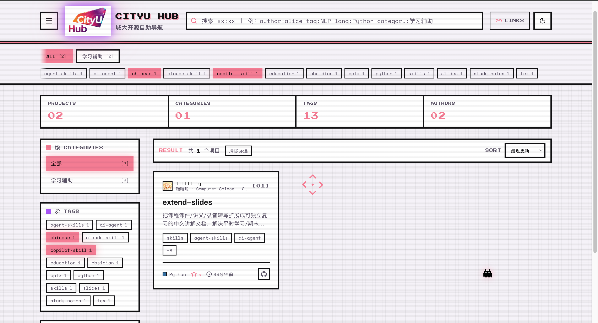

<div align="center">


# CityU Hub

**香港城大开源自助导航 · 香港城市大學學生項目和開源自助檢索平台 · Discover what CityU students are building**

[](https://github.com/Warpshlczy/CityU-Hub/actions/workflows/build.yml)
[](https://github.com/Warpshlczy/CityU-Hub/actions/workflows/validate.yml)
[](https://github.com/Warpshlczy/CityU-Hub/actions/workflows/deploy.yml)
[](https://github.com/Warpshlczy/CityU-Hub/stargazers)

[](https://nodejs.org)
[](https://react.dev)
[](https://vite.dev)
[](https://tailwindcss.com)
[](CONTRIBUTING.md)

**[简体中文](#简体中文) · [繁體中文](#繁體中文) · [English](#english)**

</div>

<div align="center">



**站点一览 · Homepage at a glance**

</div>

---

## 简体中文

### 这是什么

CityU Hub 是一个面向**香港城市大学（CityU）学生开源项目**的展示与检索网站。同学们把自己写的小工具、课程项目、科研代码提交进来，其他人在一个页面里就能按**分类 / 标签 / 语言 / 作者**筛选，搜索并直接跳到 GitHub 仓库。

我们建站的初衷：

- **散**：校内项目散落在聊天群、课程群和各人主页里，没有统一入口。
- **找不到**：想找「有没有人做过 NLP 相关的东西」时，没有任何可检索的索引。
- **认不出作者**：看得到仓库，却不知道是哪个专业、哪一届的同学。

### 网站内容与功能

| 功能 | 说明 |
| --- | --- |
| 项目浏览 | 卡片流展示项目名、摘要、标签、语言色块、Star 数与最近更新时间 |
| 搜索语法 | `author:alice`、`tag:NLP`、`lang:Python`、`category:机器学习`，可叠加 `author:alice lang:Python`；不带冒号的词走全文模糊匹配 |
| 筛选与排序 | 分类页签、标签 chips、作者榜一键筛选；支持按最近更新 / Star / 名称排序 |
| 项目详情 | 渲染仓库 README、作者实名与专业年级、Demo 与 GitHub 外链 |
| 可分享链接 | 搜索词、筛选、分类、排序、主题全部同步到 URL，刷新/分享后状态不丢 |
| 主题 | 亮 / 暗双主题切换，首屏前注入、无闪烁 |
| 常用入口 | 右上角 🔗 抽屉内置 AIMS / Canvas / 学校官网 / CityUHK Portal |

### 技术栈

**前端**：React 19 · TypeScript 5.9 · Vite 6 · Tailwind CSS v4（CSS-first）· React Router 7（HashRouter）· lucide-react
**后端**：Node.js ≥ 20.6（原生 `node:http`，零框架）· ajv（JSON Schema 校验）· js-yaml（front matter 解析）

### 项目结构

```text
CityU-Hub/
├── repos/                      # 项目条目：每个项目一个 Markdown（front matter + 正文）
│   ├── _template.md            # 提交模板，复制它开始写自己的项目
│   ├── CityU-Beamer.md
│   └── extend-slides.md
├── schema/
│   └── repo.schema.json        # front matter 的 JSON Schema，CI 用它把关
├── back-end/                   # 索引构建器 + 只读 HTTP API
│   ├── src/build-index.mjs     # repos/*.md → output/*.json（可加 --offline）
│   ├── src/validate-repos.mjs  # 按 schema 校验、项目 ID / 仓库地址查重
│   ├── src/server.mjs          # /health、/projects、/projects/:id（默认 127.0.0.1:3001）
│   └── output/                 # 构建产物，已 gitignore
├── front-end/                  # 前端站点
│   ├── public/data/            # 静态兜底数据（没有后端时也能跑）
│   └── src/
│       ├── api/                # 唯一数据出口：接口 / 静态 JSON / GitHub 元数据补齐
│       ├── components/         # 卡片、搜索栏、侧栏、筛选与排序等
│       ├── hooks/              # useProjects、useSearch、useUrlState
│       ├── pages/              # 首页、项目详情页
│       └── utils/              # 搜索语法解析、格式化、slug
├── scripts/
│   └── sync-and-build.sh       # 目标机器拉取最新代码并重建前后端
└── .github/workflows/          # build.yml（构建数据）/ validate.yml（PR 校验）/ deploy.yml（自动同步重建）
```

### 数据流

```text
repos/*.md ─► npm run validate ─► build-index ─┬─► back-end/output/*.json
                                               │        │
                       GitHub API 补 stars /   │        ├─► server.mjs（REST API）
                       语言 / license / 描述 ───┘        └─► 前端 fetch（缺失字段运行时再补）
```

- `npm run build` 会调用 GitHub API 补齐动态字段（需要 `GITHUB_TOKEN`，见 `back-end/.env.example`）。
- `npm run build:offline` 完全不联网，适合本地和 CI；缺的 Star 数、语言由前端运行时补齐并缓存在 localStorage。

### 本地运行

```bash
# 1) 生成数据并启动接口（http://127.0.0.1:3001）
cd back-end
npm install
npm run build:offline        # 有 token 时可用 npm run build
npm run start

# 2) 另开一个终端启动前端（http://localhost:5173）
cd front-end
npm install
npm run dev
```

生产构建走静态数据；要让线上也连后端，构建时设置 `VITE_API_BASE=https://你的接口地址`。

### 成为贡献者

**非常欢迎你参与 CityU Hub！** 无论你是想把自己的项目放上来、修一个前端小 bug、补一段文档，还是只提一个想法，都是这个项目需要的贡献。

#### 方式一：提交你的项目（最主要）

1. **Fork** 本仓库并 clone 到本地，从 `main` 建一个分支，例如 `feat/add-my-project`。
2. 复制 `repos/_template.md` 为 `repos/你的项目名.md`，填写 front matter 与正文。
3. 必填字段：`title`、`author`（GitHub 用户名）、`authorName`（真实姓名）、`major`（专业）、`enrollmentYear`（入学年份，四位数字）、`repoUrl`（必须是公开的 `https://github.com/...` 地址）。可选：`id`、`summary`、`homepageUrl`、`tags`（最多 12 个小写短标签）、`category`、`featured`、`status`（`active` / `hidden` / `archived`）。**schema 不允许出现未定义的字段。**
4. 正文写在 front matter 之后：你可以在这里自定义想展示的项目简介与功能介绍。如果想使用GitHub项目页上的简介，请在`Features`后面留空。如果想使用项目的README，请将项目介绍留空。程序会自动拉取你的项目。
5. 本地自检（务必先跑通）：
   ```bash
   cd back-end
   npm install
   npm run validate      # front matter 是否符合 schema、ID 与仓库地址是否重复
   npm test              # 构建器单元测试
   npm run build:offline # 确认能正常构建出数据
   ```
6. 提交 Pull Request 到 `main`。CI 会自动跑 `validate` 与测试；通过后由维护者 review 合并。合并后构建 workflow 会补齐 stars、语言、license 等动态字段并重新生成 JSON，站点随即更新。

> 目录、字段名、枚举值的完整约定见 [`CONTRIBUTING.md`](CONTRIBUTING.md) 与 [`schema/repo.schema.json`](schema/repo.schema.json)。

#### 方式二：改进网站本身

前端 / 后端 / 工作流的 PR 同样欢迎。动手前请先开一个 issue 说清楚你想做什么，避免重复劳动；提交前请确认：

```bash
cd front-end && npm run build   # 类型检查 + 打包必须通过
cd back-end  && npm test        # 后端测试必须通过
```

#### 方式三：文档、翻译与反馈

发现错别字、想补英文翻译、有更好的界面建议，都可以直接开 issue 或提 PR——这类贡献和代码同等重要。

<a href="https://github.com/Warpshlczy/CityU-Hub/graphs/contributors">
  
</a>

**期待在贡献者名单里看到你。**

---

## 繁體中文

### 這是什麼

CityU Hub 是一個面向**香港城市大學（CityU）學生開源項目**的展示與檢索網站。同學們把自己寫的小工具、課程項目、研究程式碼提交進來，其他人在同一個頁面就能按**分類 / 標籤 / 語言 / 作者**篩選，搜尋並直接跳到 GitHub 儲存庫。

網站解決的三個問題：

- **散**：校內項目散落在聊天群組、課程群組和個人主頁裡，沒有統一入口。
- **找不到**：想找「有沒有人做過 NLP 相關的東西」時，沒有任何可檢索的索引。
- **認不出作者**：看得到儲存庫，卻不知道是哪個主修、哪一屆的同學。

### 網站內容與功能

| 功能 | 說明 |
| --- | --- |
| 項目瀏覽 | 卡片流展示項目名、摘要、標籤、語言色塊、Star 數與最近更新時間 |
| 搜尋語法 | `author:alice`、`tag:NLP`、`lang:Python`、`category:機器學習`，可疊加 `author:alice lang:Python`；不帶冒號的字詞走全文模糊搜尋 |
| 篩選與排序 | 分類頁籤、標籤 chips、作者榜一鍵篩選；支援按最近更新 / Star / 名稱排序 |
| 項目詳情 | 渲染儲存庫 README、作者真實姓名與主修年級、Demo 與 GitHub 外部連結 |
| 可分享連結 | 搜尋詞、篩選、分類、排序、主題全部同步到 URL，重新整理或分享後狀態不丟 |
| 主題 | 亮 / 暗雙主題切換，首屏前注入、無閃爍 |
| 常用入口 | 右上角 🔗 抽屜內建 AIMS / Canvas / 學校官網 / CityUHK Portal |

### 技術棧

**前端**：React 19 · TypeScript 5.9 · Vite 6 · Tailwind CSS v4（CSS-first）· React Router 7（HashRouter）· lucide-react
**後端**：Node.js ≥ 20.6（原生 `node:http`，零框架）· ajv（JSON Schema 驗證）· js-yaml（front matter 解析）

### 項目結構

```text
CityU-Hub/
├── repos/                      # 項目條目：每個項目一個 Markdown（front matter + 正文）
│   ├── _template.md            # 提交模板，複製它開始寫自己的項目
│   ├── CityU-Beamer.md
│   └── extend-slides.md
├── schema/
│   └── repo.schema.json        # front matter 的 JSON Schema，CI 用它把關
├── back-end/                   # 索引建構器 + 唯讀 HTTP API
│   ├── src/build-index.mjs     # repos/*.md → output/*.json（可加 --offline）
│   ├── src/validate-repos.mjs  # 按 schema 驗證、項目 ID / 儲存庫網址檢查重複
│   ├── src/server.mjs          # /health、/projects、/projects/:id（預設 127.0.0.1:3001）
│   └── output/                 # 建構產物，已 gitignore
├── front-end/                  # 前端網站
│   ├── public/data/            # 靜態備援資料（沒有後端時也能執行）
│   └── src/
│       ├── api/                # 唯一資料出口：介面 / 靜態 JSON / GitHub 中繼資料補齊
│       ├── components/         # 卡片、搜尋列、側欄、篩選與排序等
│       ├── hooks/              # useProjects、useSearch、useUrlState
│       ├── pages/              # 首頁、項目詳情頁
│       └── utils/              # 搜尋語法解析、格式化、slug
├── scripts/
│   └── sync-and-build.sh       # 目標機器拉取最新程式碼並重建前後端
└── .github/workflows/          # build.yml（建構資料）/ validate.yml（PR 驗證）/ deploy.yml（自動同步重建）
```

### 資料流

```text
repos/*.md ─► npm run validate ─► build-index ─┬─► back-end/output/*.json
                                               │        │
                       GitHub API 補 stars /   │        ├─► server.mjs（REST API）
                       語言 / license / 描述 ───┘        └─► 前端 fetch（缺失欄位執行時再補）
```

- `npm run build` 會呼叫 GitHub API 補齊動態欄位（需要 `GITHUB_TOKEN`，見 `back-end/.env.example`）。
- `npm run build:offline` 完全不連網，適合本機與 CI；缺的 Star 數、語言由前端執行時補齊並快取在 localStorage。

### 本機執行

```bash
# 1) 產生資料並啟動介面（http://127.0.0.1:3001）
cd back-end
npm install
npm run build:offline        # 有 token 時可用 npm run build
npm run start

# 2) 另開一個終端機啟動前端（http://localhost:5173）
cd front-end
npm install
npm run dev
```

正式建置走靜態資料；要讓線上環境也連後端，建置時設定 `VITE_API_BASE=https://你的介面位址`。

### 成為貢獻者

**非常歡迎你參與 CityU Hub！** 無論你是想把自己的項目放上來、修一個前端小 bug、補一段文件，還是只提一個想法，都是這個項目需要的貢獻。

#### 方式一：提交你的項目（最主要）

1. **Fork** 本儲存庫並 clone 到本機，從 `main` 開一個分支，例如 `feat/add-my-project`。
2. 複製 `repos/_template.md` 為 `repos/你的項目名.md`，填寫 front matter 與正文。
3. 必填欄位：`title`、`author`（GitHub 使用者名稱）、`authorName`（真實姓名）、`major`（主修）、`enrollmentYear`（入學年份，四位數字）、`repoUrl`（必須是公開的 `https://github.com/...` 位址）。可選：`id`、`summary`、`homepageUrl`、`tags`（最多 12 個小寫短標籤）、`category`、`featured`、`status`（`active` / `hidden` / `archived`）。**schema 不允許出現未定義的欄位。**
4. 正文寫在 front matter 之後：填了 `summary` 就用摘要，正文留空則回退到展示你儲存庫的 README。
5. 本機自我檢查（務必先跑通）：
   ```bash
   cd back-end
   npm install
   npm run validate      # front matter 是否符合 schema、ID 與儲存庫網址是否重複
   npm test              # 建構器單元測試
   npm run build:offline # 確認能正常建構出資料
   ```
6. 提交 Pull Request 到 `main`。CI 會自動跑 `validate` 與測試；通過後由維護者 review 合併。合併後建構 workflow 會補齊 stars、語言、license 等動態欄位並重新產生 JSON，網站隨即更新。

> 目錄、欄位名稱、列舉值的完整約定見 [`CONTRIBUTING.md`](CONTRIBUTING.md) 與 [`schema/repo.schema.json`](schema/repo.schema.json)。

#### 方式二：改進網站本身

前端 / 後端 / workflow 的 PR 同樣歡迎。動手前請先開一個 issue 說清楚你想做什麼，避免重複勞動；提交前請確認：

```bash
cd front-end && npm run build   # 型別檢查 + 打包必須通過
cd back-end  && npm test        # 後端測試必須通過
```

#### 方式三：文件、翻譯與回饋

發現錯別字、想補英文翻譯、有更好的介面建議，都可以直接開 issue 或提 PR——這類貢獻和程式碼同等重要。

<a href="https://github.com/Warpshlczy/CityU-Hub/graphs/contributors">
  
</a>

**期待在貢獻者名單裡看到你。**

---

## English

### What is this

CityU Hub is a showcase and search site for **open-source projects built by students of City University of Hong Kong (CityU)**. Students submit their tools, course projects and research code; everyone else can filter by **category / tag / language / author**, search, and jump straight to the GitHub repository from a single page.

The three problems it solves:

- **Fragmentation** — campus projects are scattered across group chats, course channels and personal pages, with no single entry point.
- **No index** — there is no way to answer "has anyone here worked on NLP?" without asking around.
- **Unknown authors** — you can see a repository but not the major or enrollment year behind it.

### Content & features

| Feature | Description |
| --- | --- |
| Project browsing | Cards show name, summary, tags, language colour, stars and last update |
| Search syntax | `author:alice`, `tag:NLP`, `lang:Python`, `category:Machine Learning`, combinable as `author:alice lang:Python`; plain words fall back to fuzzy full-text search |
| Filters & sorting | Category tabs, tag chips and an author board for one-click filtering; sort by recently updated / stars / name |
| Project detail | Renders the repository README, the author's real name, major and enrollment year, plus demo and GitHub links |
| Shareable URLs | Query, filters, category, sort and theme are all synced to the URL, so refresh and sharing keep the exact view |
| Theme | Light / dark toggle injected before first paint, with no flash |
| Useful links | The 🔗 drawer in the header collects AIMS / Canvas / CityU website / CityUHK Portal |

### Tech stack

**Front end**: React 19 · TypeScript 5.9 · Vite 6 · Tailwind CSS v4 (CSS-first) · React Router 7 (HashRouter) · lucide-react
**Back end**: Node.js ≥ 20.6 (native `node:http`, no framework) · ajv (JSON Schema validation) · js-yaml (front matter parsing)

### Project structure

```text
CityU-Hub/
├── repos/                      # One Markdown file per project (front matter + body)
│   ├── _template.md            # Submission template — copy it to get started
│   ├── CityU-Beamer.md
│   └── extend-slides.md
├── schema/
│   └── repo.schema.json        # JSON Schema for the front matter, enforced by CI
├── back-end/                   # Index builder + read-only HTTP API
│   ├── src/build-index.mjs     # repos/*.md → output/*.json (supports --offline)
│   ├── src/validate-repos.mjs  # Schema validation, duplicate id / repoUrl detection
│   ├── src/server.mjs          # /health, /projects, /projects/:id (127.0.0.1:3001 by default)
│   └── output/                 # Build artefacts, gitignored
├── front-end/                  # The website
│   ├── public/data/            # Static fallback data (works without the API)
│   └── src/
│       ├── api/                # Single data entry: API / static JSON / GitHub metadata
│       ├── components/         # Cards, search bar, sidebar, filters and sorting
│       ├── hooks/              # useProjects, useSearch, useUrlState
│       ├── pages/              # Home, project detail
│       └── utils/              # Search parser, formatting, slug helpers
├── scripts/
│   └── sync-and-build.sh       # Pull the latest code on a target machine and rebuild
└── .github/workflows/          # build.yml (data) / validate.yml (PR checks) / deploy.yml (auto sync & rebuild)
```

### Data flow

```text
repos/*.md ─► npm run validate ─► build-index ─┬─► back-end/output/*.json
                                               │        │
                  GitHub API fills stars /     │        ├─► server.mjs (REST API)
                  language / license / desc ────┘        └─► front-end fetch (missing fields filled at runtime)
```

- `npm run build` enriches the data through the GitHub API (needs `GITHUB_TOKEN`, see `back-end/.env.example`).
- `npm run build:offline` never touches the network — ideal for local runs and CI; missing stars / language are filled by the front end at runtime and cached in localStorage.

### Local development

```bash
# 1) Build the data and start the API (http://127.0.0.1:3001)
cd back-end
npm install
npm run build:offline        # use `npm run build` when a token is available
npm run start

# 2) In another terminal, start the front end (http://localhost:5173)
cd front-end
npm install
npm run dev
```

Production builds ship with static data; set `VITE_API_BASE=https://your-api-host` at build time to talk to a backend in production.

### Become a contributor

**You are very welcome to contribute to CityU Hub!** Adding your own project, fixing a small front-end bug, improving docs or just sharing an idea — all of it moves this project forward.

#### Option 1: Submit your project (the main path)

1. **Fork** this repository, clone it, and branch off `main`, e.g. `feat/add-my-project`.
2. Copy `repos/_template.md` to `repos/your-project.md` and fill in the front matter and the body.
3. Required fields: `title`, `author` (GitHub username), `authorName`, `major`, `enrollmentYear` (four digits), `repoUrl` (must be a public `https://github.com/...` URL). Optional: `id`, `summary`, `homepageUrl`, `tags` (max 12 short lowercase tags), `category`, `featured`, `status` (`active` / `hidden` / `archived`). **The schema rejects any undefined field.**
4. Put your description after the front matter: with `summary` set it is used as the card text; leave the body empty to fall back to your repository README.
5. Verify locally before opening the PR:
   ```bash
   cd back-end
   npm install
   npm run validate      # schema conformance, duplicate id / repoUrl
   npm test              # builder unit tests
   npm run build:offline # make sure the data builds
   ```
6. Open a Pull Request against `main`. CI runs `validate` plus the test suite; a maintainer reviews and merges. Once merged, the build workflow refreshes stars, language, license and other dynamic fields, regenerates the JSON, and the site updates.

> Full conventions for files, field names and enum values live in [`CONTRIBUTING.md`](CONTRIBUTING.md) and [`schema/repo.schema.json`](schema/repo.schema.json).

#### Option 2: Improve the site itself

PRs for the front end, back end and workflows are welcome. Please open an issue first so we can avoid duplicated effort, and make sure these pass:

```bash
cd front-end && npm run build   # type-check + bundle must succeed
cd back-end  && npm test        # backend tests must succeed
```

#### Option 3: Docs, translation and feedback

Typos, English translations, UI suggestions — open an issue or send a PR. These contributions matter as much as code.

<a href="https://github.com/Warpshlczy/CityU-Hub/graphs/contributors">
  
</a>

**We look forward to seeing your name among the contributors.**

---

<div align="center">

**[回到顶部 / Back to top](#cityu-hub)**

Made by CityU students

</div>
