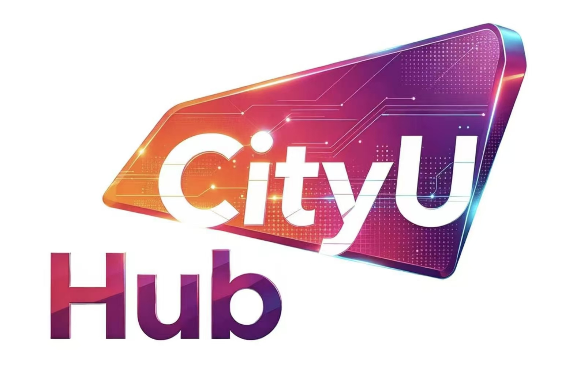
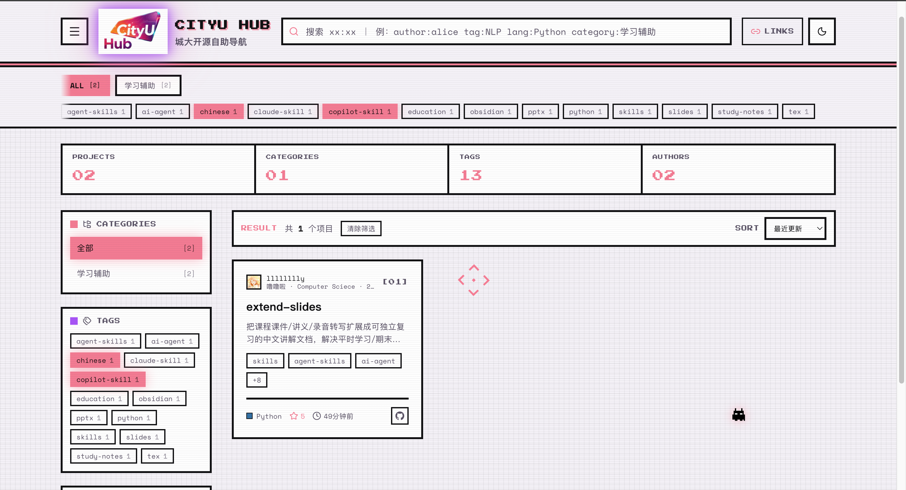

<div align="center">



# CityU Hub

**香港城大开源自助导航 · 香港城市大學學生項目和開源自助檢索平台 · Discover what CityU students are building**

[](https://github.com/Warpshlczy/CityU-Hub/actions/workflows/ci.yml)
[](https://github.com/Warpshlczy/CityU-Hub/actions/workflows/deploy.yml)
[](https://github.com/Warpshlczy/CityU-Hub/stargazers)

[](https://nodejs.org)
[](https://react.dev)
[](https://vite.dev)
[](https://tailwindcss.com)
[](CONTRIBUTING.md)

**[简体中文](#简体中文) · [繁體中文](#繁體中文) · [English](#english)**

</div>

<div align="center">



**站点一览 · Homepage at a glance**

</div>

---

## 简体中文

### 这是什么

CityU Hub 是一个面向**香港城市大学（CityU）学生开源项目**的展示与检索网站。同学们把自己写的小工具、课程项目、科研代码提交进来，其他人在一个页面里就能按**分类 / 标签 / 语言 / 作者**筛选，搜索并直接跳到 GitHub 仓库。

我们建站的初衷：

- **散**：校内项目散落在聊天群、课程群和各人主页里，没有统一入口。
- **找不到**：想找「有没有人做过 NLP 相关的东西」时，没有任何可检索的索引。
- **认不出作者**：看得到仓库，却不知道是哪个专业、哪一届的同学。

### 网站内容与功能

| 功能 | 说明 |
| --- | --- |
| 项目浏览 | 卡片流展示项目名、摘要、标签、语言色块、Star 数与最近更新时间 |
| 搜索语法 | `author:alice`、`tag:NLP`、`lang:Python`、`category:机器学习`，可叠加 `author:alice lang:Python`；不带冒号的词走全文模糊匹配 |
| 筛选与排序 | 分类页签、标签 chips、作者榜一键筛选；支持按最近更新 / Star / 名称排序 |
| 项目详情 | 渲染仓库 README、作者实名与专业年级、Demo 与 GitHub 外链 |
| 可分享链接 | 搜索词、筛选、分类、排序、主题全部同步到 URL，刷新/分享后状态不丢 |
| 主题 | 亮 / 暗双主题切换，首屏前注入、无闪烁 |
| 常用入口 | 右上角 🔗 抽屉内置 AIMS / Canvas / 学校官网 / CityUHK Portal |

### 技术栈

**前端**：React 19 · TypeScript 5.9 · Vite 6 · Tailwind CSS v4（CSS-first）· React Router 7（HashRouter）· lucide-react
**解析器**：Node.js ≥ 20.6 · marked（Markdown → HTML）· ajv（JSON Schema 校验）· js-yaml（front matter 解析）

### 项目结构

```text
CityU-Hub/
├── repos/                      # 项目条目：每个项目一个 Markdown（front matter + 正文）
│   ├── _template.md            # 提交模板，复制它开始写自己的项目
│   ├── CityU-Beamer.md
│   └── extend-slides.md
├── schema/
│   └── repo.schema.json        # front matter 的 JSON Schema，CI 用它把关
├── repos-parser/               # 解析器：repos/*.md → web/public/data/*.json
│   ├── src/build-index.mjs     # 生成列表、聚合与项目详情（含渲染好的 README HTML）
│   ├── src/validate-repos.mjs  # 按 schema 校验、项目 ID / 仓库地址查重
│   └── src/lib/                # front matter、Markdown、GitHub、聚合等纯函数
├── web/                        # 前端站点（一条 npm 命令完成解析 + 打包）
│   ├── public/data/            # 解析产物，已 gitignore，每次构建重新生成
│   └── src/
│       ├── api/                # 读静态 JSON，并在运行时用 GitHub 补齐缺失字段
│       ├── components/         # 卡片、搜索栏、侧栏、筛选与排序等
│       ├── hooks/              # useProjects、useSearch、useUrlState
│       ├── pages/              # 首页、项目详情页
│       └── utils/              # 搜索语法解析、格式化、slug
├── scripts/
│   └── sync-and-build.sh       # 目标机器拉取最新代码并重建站点
├── vercel.json                 # Vercel 部署配置（构建命令 / 输出目录 / 关闭框架预设）
└── .github/workflows/          # ci.yml（校验 + 构建）/ deploy.yml（自托管机器同步重建）
```

`repos-parser` 与 `web` 通过根目录的 **npm workspaces** 串起来，`npm install` 一次装好两边依赖。

### 数据流

```text
repos/*.md ─► npm run validate ─► repos-parser ─► web/public/data/*.json ─► vite build ─► web/dist
                                                      ▲
                                    GitHub API 补 stars / 语言 / 头像（可选）
```

解析器直接产出前端契约的 JSON，没有中间接口层：

- `data/projects.json`：项目列表 + 标签 / 作者 / 分类聚合
- `data/projects/<id>.json`：单个项目详情，`readmeHtml` 已渲染好，前端直接插入

`npm run build` 离线解析，产物完全可复现；`npm run build:online` 会额外调用 GitHub API 补齐 stars、语言、头像（需要 `GITHUB_TOKEN`，见 `repos-parser/.env.example`），缺失的字段前端也会在运行时补齐并缓存在 localStorage。

### 本地运行

```bash
npm install     # 根目录一次装好 repos-parser 与 web 的依赖
npm run dev     # 先解析 repos/*.md，再启动 http://localhost:5173
```

常用命令：

```bash
npm run build        # 解析 + 类型检查 + 打包，产物在 web/dist
npm run build:online # 同上，但联网补齐 stars / 语言 / 头像
npm run preview      # 本地预览构建产物
npm run validate     # 校验 repos/*.md 的 front matter、Schema 与重复项
npm test             # 解析器单元测试
```

### 一键部署到 Vercel

整站是纯静态产物，Vercel 的 Git 集成会在每次 push 后自动拉取代码、重新解析 `repos/*.md` 并重新发布，不需要任何手动步骤。

**首次导入**：Vercel Dashboard → Add New → Project → Import 本仓库，然后按下面这张表确认设置：

| 设置项 | 值 | 说明 |
| --- | --- | --- |
| Root Directory | **留空（仓库根目录）** | 必须留空，npm workspaces 要从根目录统一安装依赖 |
| Framework Preset | Other | [`vercel.json`](vercel.json) 已用 `"framework": null` 固定，避免被识别成 Vite 后去根目录找 `dist` |
| Build Command | `npm run build` | 已由 `vercel.json` 声明，无需手填 |
| Output Directory | `web/dist` | 已由 `vercel.json` 声明，无需手填 |
| Node.js Version | 24.x | 来自根 [`package.json`](package.json) 的 `engines.node` |

其余保持默认，点 Deploy 即可。构建过程等价于本机的这两条命令：

```bash
npm install    # 根目录一次装好 repos-parser 与 web 的依赖
npm run build  # 解析 repos/*.md → 类型检查 → 打包到 web/dist
```

想用静态数据补齐 stars / 语言 / 头像，在 Vercel 项目的环境变量里加一个 `GITHUB_TOKEN`，并把构建命令改成 `npm run build:online`。

> `scripts/sync-and-build.sh` 与 [`.github/workflows/deploy.yml`](.github/workflows/deploy.yml) 是给自建服务器（38.175.192.15）用的：由自托管 runner 或 crontab 轮询拉取最新代码并重建，与 Vercel 互不影响。

### 成为贡献者

**非常欢迎你参与 CityU Hub！** 无论你是想把自己的项目放上来、修一个前端小 bug、补一段文档，还是只提一个想法，都是这个项目需要的贡献。

#### 方式一：提交你的项目（最主要）

1. **Fork** 本仓库并 clone 到本地，从 `main` 建一个分支，例如 `feat/add-my-project`。
2. 复制 `repos/_template.md` 为 `repos/你的项目名.md`，填写 front matter 与正文。
3. 必填字段：`title`、`author`（GitHub 用户名）、`authorName`（真实姓名）、`major`（专业）、`enrollmentYear`（入学年份，四位数字）、`repoUrl`（必须是公开的 `https://github.com/...` 地址）。可选：`id`、`summary`、`homepageUrl`、`tags`（最多 12 个小写短标签）、`category`、`featured`、`status`（`active` / `hidden` / `archived`）。**schema 不允许出现未定义的字段。**
4. 正文写在 front matter 之后：你可以在这里自定义想展示的项目简介与功能介绍。如果想使用 GitHub 项目页上的简介，请在 `Features` 后面留空；如果想使用项目的 README，请将项目介绍留空。程序会自动拉取。
5. 本地自检（务必先跑通）：
   ```bash
   npm install
   npm run validate   # front matter 是否符合 schema、ID 与仓库地址是否重复
   npm test           # 解析器单元测试
   npm run build      # 确认能正常解析并构建出站点
   ```
6. 提交 Pull Request 到 `main`。CI 会自动跑 `validate`、测试与整站构建；通过后由维护者 review 合并。合并后托管平台会自动重新构建发布，站点随即更新。

> 目录、字段名、枚举值的完整约定见 [`CONTRIBUTING.md`](CONTRIBUTING.md) 与 [`schema/repo.schema.json`](schema/repo.schema.json)。

#### 方式二：改进网站本身

前端 / 解析器 / 工作流的 PR 同样欢迎。动手前请先开一个 issue 说清楚你想做什么，避免重复劳动；提交前请确认：

```bash
npm test        # 解析器测试必须通过
npm run build   # 类型检查 + 打包必须通过
```

#### 方式三：文档、翻译与反馈

发现错别字、想补英文翻译、有更好的界面建议，都可以直接开 issue 或提 PR——这类贡献和代码同等重要。

<a href="https://github.com/Warpshlczy/CityU-Hub/graphs/contributors">
  
</a>

**期待在贡献者名单里看到你。**

---

## 繁體中文

### 這是什麼

CityU Hub 是一個面向**香港城市大學（CityU）學生開源項目**的展示與檢索網站。同學們把自己寫的小工具、課程項目、研究程式碼提交進來，其他人在同一個頁面就能按**分類 / 標籤 / 語言 / 作者**篩選，搜尋並直接跳到 GitHub 儲存庫。

網站解決的三個問題：

- **散**：校內項目散落在聊天群組、課程群組和個人主頁裡，沒有統一入口。
- **找不到**：想找「有沒有人做過 NLP 相關的東西」時，沒有任何可檢索的索引。
- **認不出作者**：看得到儲存庫，卻不知道是哪個主修、哪一屆的同學。

### 網站內容與功能

| 功能 | 說明 |
| --- | --- |
| 項目瀏覽 | 卡片流展示項目名、摘要、標籤、語言色塊、Star 數與最近更新時間 |
| 搜尋語法 | `author:alice`、`tag:NLP`、`lang:Python`、`category:機器學習`，可疊加 `author:alice lang:Python`；不帶冒號的字詞走全文模糊搜尋 |
| 篩選與排序 | 分類頁籤、標籤 chips、作者榜一鍵篩選；支援按最近更新 / Star / 名稱排序 |
| 項目詳情 | 渲染儲存庫 README、作者真實姓名與主修年級、Demo 與 GitHub 外部連結 |
| 可分享連結 | 搜尋詞、篩選、分類、排序、主題全部同步到 URL，重新整理或分享後狀態不丟 |
| 主題 | 亮 / 暗雙主題切換，首屏前注入、無閃爍 |
| 常用入口 | 右上角 🔗 抽屜內建 AIMS / Canvas / 學校官網 / CityUHK Portal |

### 技術棧

**前端**：React 19 · TypeScript 5.9 · Vite 6 · Tailwind CSS v4（CSS-first）· React Router 7（HashRouter）· lucide-react
**解析器**：Node.js ≥ 20.6 · marked（Markdown → HTML）· ajv（JSON Schema 驗證）· js-yaml（front matter 解析）

### 項目結構

```text
CityU-Hub/
├── repos/                      # 項目條目：每個項目一個 Markdown（front matter + 正文）
│   ├── _template.md            # 提交模板，複製它開始寫自己的項目
│   ├── CityU-Beamer.md
│   └── extend-slides.md
├── schema/
│   └── repo.schema.json        # front matter 的 JSON Schema，CI 用它把關
├── repos-parser/               # 解析器：repos/*.md → web/public/data/*.json
│   ├── src/build-index.mjs     # 產生列表、聚合與項目詳情（含渲染好的 README HTML）
│   ├── src/validate-repos.mjs  # 按 schema 驗證、項目 ID / 儲存庫網址檢查重複
│   └── src/lib/                # front matter、Markdown、GitHub、聚合等純函式
├── web/                        # 前端網站（一條 npm 指令完成解析 + 打包）
│   ├── public/data/            # 解析產物，已 gitignore，每次建構重新產生
│   └── src/
│       ├── api/                # 讀靜態 JSON，並在執行時用 GitHub 補齊缺失欄位
│       ├── components/         # 卡片、搜尋列、側欄、篩選與排序等
│       ├── hooks/              # useProjects、useSearch、useUrlState
│       ├── pages/              # 首頁、項目詳情頁
│       └── utils/              # 搜尋語法解析、格式化、slug
├── scripts/
│   └── sync-and-build.sh       # 目標機器拉取最新程式碼並重建網站
├── vercel.json                 # Vercel 部署設定（建構指令 / 輸出目錄 / 關閉框架預設）
└── .github/workflows/          # ci.yml（驗證 + 建構）/ deploy.yml（自架機器同步重建）
```

`repos-parser` 與 `web` 透過根目錄的 **npm workspaces** 串起來，`npm install` 一次裝好兩邊依賴。

### 資料流

```text
repos/*.md ─► npm run validate ─► repos-parser ─► web/public/data/*.json ─► vite build ─► web/dist
                                                      ▲
                                    GitHub API 補 stars / 語言 / 頭像（可選）
```

解析器直接產出前端契約的 JSON，沒有中間介面層：

- `data/projects.json`：項目列表 + 標籤 / 作者 / 分類聚合
- `data/projects/<id>.json`：單個項目詳情，`readmeHtml` 已渲染好，前端直接插入

`npm run build` 離線解析，產物完全可重現；`npm run build:online` 會額外呼叫 GitHub API 補齊 stars、語言、頭像（需要 `GITHUB_TOKEN`，見 `repos-parser/.env.example`），缺失的欄位前端也會在執行時補齊並快取在 localStorage。

### 本機執行

```bash
npm install     # 根目錄一次裝好 repos-parser 與 web 的依賴
npm run dev     # 先解析 repos/*.md，再啟動 http://localhost:5173
```

常用指令：

```bash
npm run build        # 解析 + 型別檢查 + 打包，產物在 web/dist
npm run build:online # 同上，但連網補齊 stars / 語言 / 頭像
npm run preview      # 本機預覽建構產物
npm run validate     # 驗證 repos/*.md 的 front matter、Schema 與重複項
npm test             # 解析器單元測試
```

### 一鍵部署到 Vercel

整站是純靜態產物，Vercel 的 Git 整合會在每次 push 後自動拉取程式碼、重新解析 `repos/*.md` 並重新發佈，不需要任何手動步驟。

**首次匯入**：Vercel Dashboard → Add New → Project → Import 本儲存庫，然後按下面這張表確認設定：

| 設定項 | 值 | 說明 |
| --- | --- | --- |
| Root Directory | **留空（儲存庫根目錄）** | 必須留空，npm workspaces 要從根目錄統一安裝依賴 |
| Framework Preset | Other | [`vercel.json`](vercel.json) 已用 `"framework": null` 固定，避免被識別成 Vite 後去根目錄找 `dist` |
| Build Command | `npm run build` | 已由 `vercel.json` 宣告，無需手填 |
| Output Directory | `web/dist` | 已由 `vercel.json` 宣告，無需手填 |
| Node.js Version | 24.x | 來自根 [`package.json`](package.json) 的 `engines.node` |

其餘保持預設，點 Deploy 即可。建構過程等於本機這兩條指令：

```bash
npm install    # 根目錄一次裝好 repos-parser 與 web 的依賴
npm run build  # 解析 repos/*.md → 型別檢查 → 打包到 web/dist
```

想用靜態資料補齊 stars / 語言 / 頭像，在 Vercel 專案的環境變數裡加一個 `GITHUB_TOKEN`，並把建構指令改成 `npm run build:online`。

> `scripts/sync-and-build.sh` 與 [`.github/workflows/deploy.yml`](.github/workflows/deploy.yml) 是給自架伺服器（38.175.192.15）用的：由自託管 runner 或 crontab 輪詢拉取最新程式碼並重建，與 Vercel 互不影響。

### 成為貢獻者

**非常歡迎你參與 CityU Hub！** 無論你是想把自己的項目放上來、修一個前端小 bug、補一段文件，還是只提一個想法，都是這個項目需要的貢獻。

#### 方式一：提交你的項目（最主要）

1. **Fork** 本儲存庫並 clone 到本機，從 `main` 開一個分支，例如 `feat/add-my-project`。
2. 複製 `repos/_template.md` 為 `repos/你的項目名.md`，填寫 front matter 與正文。
3. 必填欄位：`title`、`author`（GitHub 使用者名稱）、`authorName`（真實姓名）、`major`（主修）、`enrollmentYear`（入學年份，四位數字）、`repoUrl`（必須是公開的 `https://github.com/...` 位址）。可選：`id`、`summary`、`homepageUrl`、`tags`（最多 12 個小寫短標籤）、`category`、`featured`、`status`（`active` / `hidden` / `archived`）。**schema 不允許出現未定義的欄位。**
4. 正文寫在 front matter 之後：填了 `summary` 就用摘要，正文留空則回退到展示你儲存庫的 README。
5. 本機自我檢查（務必先跑通）：
   ```bash
   npm install
   npm run validate   # front matter 是否符合 schema、ID 與儲存庫網址是否重複
   npm test           # 解析器單元測試
   npm run build      # 確認能正常解析並建構出網站
   ```
6. 提交 Pull Request 到 `main`。CI 會自動跑 `validate`、測試與整站建構；通過後由維護者 review 合併。合併後託管平台會自動重新建構發佈，網站隨即更新。

> 目錄、欄位名稱、列舉值的完整約定見 [`CONTRIBUTING.md`](CONTRIBUTING.md) 與 [`schema/repo.schema.json`](schema/repo.schema.json)。

#### 方式二：改進網站本身

前端 / 解析器 / workflow 的 PR 同樣歡迎。動手前請先開一個 issue 說清楚你想做什麼，避免重複勞動；提交前請確認：

```bash
npm test        # 解析器測試必須通過
npm run build   # 型別檢查 + 打包必須通過
```

#### 方式三：文件、翻譯與回饋

發現錯別字、想補英文翻譯、有更好的介面建議，都可以直接開 issue 或提 PR——這類貢獻和程式碼同等重要。

<a href="https://github.com/Warpshlczy/CityU-Hub/graphs/contributors">
  
</a>

**期待在貢獻者名單裡看到你。**

---

## English

### What is this

CityU Hub is a showcase and search site for **open-source projects built by students of City University of Hong Kong (CityU)**. Students submit their tools, course projects and research code; everyone else can filter by **category / tag / language / author**, search, and jump straight to the GitHub repository from a single page.

The three problems it solves:

- **Fragmentation** — campus projects are scattered across group chats, course channels and personal pages, with no single entry point.
- **No index** — there is no way to answer "has anyone here worked on NLP?" without asking around.
- **Unknown authors** — you can see a repository but not the major or enrollment year behind it.

### Content & features

| Feature | Description |
| --- | --- |
| Project browsing | Cards show name, summary, tags, language colour, stars and last update |
| Search syntax | `author:alice`, `tag:NLP`, `lang:Python`, `category:Machine Learning`, combinable as `author:alice lang:Python`; plain words fall back to fuzzy full-text search |
| Filters & sorting | Category tabs, tag chips and an author board for one-click filtering; sort by recently updated / stars / name |
| Project detail | Renders the repository README, the author's real name, major and enrollment year, plus demo and GitHub links |
| Shareable URLs | Query, filters, category, sort and theme are all synced to the URL, so refresh and sharing keep the exact view |
| Theme | Light / dark toggle injected before first paint, with no flash |
| Useful links | The 🔗 drawer in the header collects AIMS / Canvas / CityU website / CityUHK Portal |

### Tech stack

**Front end**: React 19 · TypeScript 5.9 · Vite 6 · Tailwind CSS v4 (CSS-first) · React Router 7 (HashRouter) · lucide-react
**Parser**: Node.js ≥ 20.6 · marked (Markdown → HTML) · ajv (JSON Schema validation) · js-yaml (front matter parsing)

### Project structure

```text
CityU-Hub/
├── repos/                      # One Markdown file per project (front matter + body)
│   ├── _template.md            # Submission template — copy it to get started
│   ├── CityU-Beamer.md
│   └── extend-slides.md
├── schema/
│   └── repo.schema.json        # JSON Schema for the front matter, enforced by CI
├── repos-parser/               # Parser: repos/*.md → web/public/data/*.json
│   ├── src/build-index.mjs     # Builds the list, aggregates and details (README pre-rendered)
│   ├── src/validate-repos.mjs  # Schema validation, duplicate id / repoUrl detection
│   └── src/lib/                # Front matter, Markdown, GitHub and aggregation helpers
├── web/                        # The website (one npm command parses + bundles)
│   ├── public/data/            # Parser output, gitignored and regenerated on every build
│   └── src/
│       ├── api/                # Reads static JSON, fills gaps from GitHub at runtime
│       ├── components/         # Cards, search bar, sidebar, filters and sorting
│       ├── hooks/              # useProjects, useSearch, useUrlState
│       ├── pages/              # Home, project detail
│       └── utils/              # Search parser, formatting, slug helpers
├── scripts/
│   └── sync-and-build.sh       # Pull the latest code on a target machine and rebuild
├── vercel.json                 # Vercel deployment config (build / output dir / framework preset off)
└── .github/workflows/          # ci.yml (validate + build) / deploy.yml (self-hosted sync)
```

`repos-parser` and `web` are wired together with **npm workspaces**, so a single `npm install` covers both.

### Data flow

```text
repos/*.md ─► npm run validate ─► repos-parser ─► web/public/data/*.json ─► vite build ─► web/dist
                                                      ▲
                                    GitHub API fills stars / language / avatar (optional)
```

The parser emits the front-end contract directly, with no API layer in between:

- `data/projects.json` — project list plus tag / author / category aggregates
- `data/projects/<id>.json` — one project, with `readmeHtml` already rendered for the detail page

`npm run build` parses offline, so artefacts are fully reproducible. `npm run build:online` additionally calls the GitHub API to fill in stars, language and avatars (needs `GITHUB_TOKEN`, see `repos-parser/.env.example`); anything still missing is filled by the front end at runtime and cached in localStorage.

### Local development

```bash
npm install     # installs both workspaces from the repo root
npm run dev     # parses repos/*.md, then serves http://localhost:5173
```

Useful commands:

```bash
npm run build        # parse + type-check + bundle, output in web/dist
npm run build:online # same, but fills stars / language / avatars from GitHub
npm run preview      # preview the production build locally
npm run validate     # check front matter, schema and duplicate entries in repos/*.md
npm test             # parser unit tests
```

### One-command deployment to Vercel

The whole site is static, and Vercel's Git integration pulls the latest code, re-parses `repos/*.md` and republishes on every push — nothing manual.

**First import**: Vercel Dashboard → Add New → Project → Import this repository, then confirm the settings below:

| Setting | Value | Notes |
| --- | --- | --- |
| Root Directory | **leave empty (repo root)** | Required — npm workspaces must install from the repo root |
| Framework Preset | Other | Pinned by `"framework": null` in [`vercel.json`](vercel.json), so Vercel does not treat this as Vite and look for `dist` at the root |
| Build Command | `npm run build` | Already declared in `vercel.json` |
| Output Directory | `web/dist` | Already declared in `vercel.json` |
| Node.js Version | 24.x | Taken from `engines.node` in the root [`package.json`](package.json) |

Leave everything else at its default and press Deploy. The build is equivalent to these two local commands:

```bash
npm install    # installs both repos-parser and web from the repo root
npm run build  # parses repos/*.md → type-check → bundles into web/dist
```

To bake stars / language / avatars into the static data, add a `GITHUB_TOKEN` environment variable to the Vercel project and switch the build command to `npm run build:online`.

> `scripts/sync-and-build.sh` and [`.github/workflows/deploy.yml`](.github/workflows/deploy.yml) cover the self-hosted route (38.175.192.15): a self-hosted runner or a crontab poll pulls the latest code and rebuilds, independently of Vercel.

### Become a contributor

**You are very welcome to contribute to CityU Hub!** Adding your own project, fixing a small front-end bug, improving docs or just sharing an idea — all of it moves this project forward.

#### Option 1: Submit your project (the main path)

1. **Fork** this repository, clone it, and branch off `main`, e.g. `feat/add-my-project`.
2. Copy `repos/_template.md` to `repos/your-project.md` and fill in the front matter and the body.
3. Required fields: `title`, `author` (GitHub username), `authorName`, `major`, `enrollmentYear` (four digits), `repoUrl` (must be a public `https://github.com/...` URL). Optional: `id`, `summary`, `homepageUrl`, `tags` (max 12 short lowercase tags), `category`, `featured`, `status` (`active` / `hidden` / `archived`). **The schema rejects any undefined field.**
4. Put your description after the front matter: with `summary` set it is used as the card text; leave the body empty to fall back to your repository README.
5. Verify locally before opening the PR:
   ```bash
   npm install
   npm run validate   # schema conformance, duplicate id / repoUrl
   npm test           # parser unit tests
   npm run build      # make sure the site parses and builds
   ```
6. Open a Pull Request against `main`. CI runs `validate`, the test suite and a full site build; a maintainer reviews and merges. Once merged, the hosting platform rebuilds and publishes automatically, and the site updates.

> Full conventions for files, field names and enum values live in [`CONTRIBUTING.md`](CONTRIBUTING.md) and [`schema/repo.schema.json`](schema/repo.schema.json).

#### Option 2: Improve the site itself

PRs for the front end, the parser and the workflows are welcome. Please open an issue first so we can avoid duplicated effort, and make sure these pass:

```bash
npm test        # parser tests must succeed
npm run build   # type-check + bundle must succeed
```

#### Option 3: Docs, translation and feedback

Typos, English translations, UI suggestions — open an issue or send a PR. These contributions matter as much as code.

<a href="https://github.com/Warpshlczy/CityU-Hub/graphs/contributors">
  
</a>

**We look forward to seeing your name among the contributors.**

---

<div align="center">

**[回到顶部 / Back to top](#cityu-hub)**

Made by CityU students

</div>
